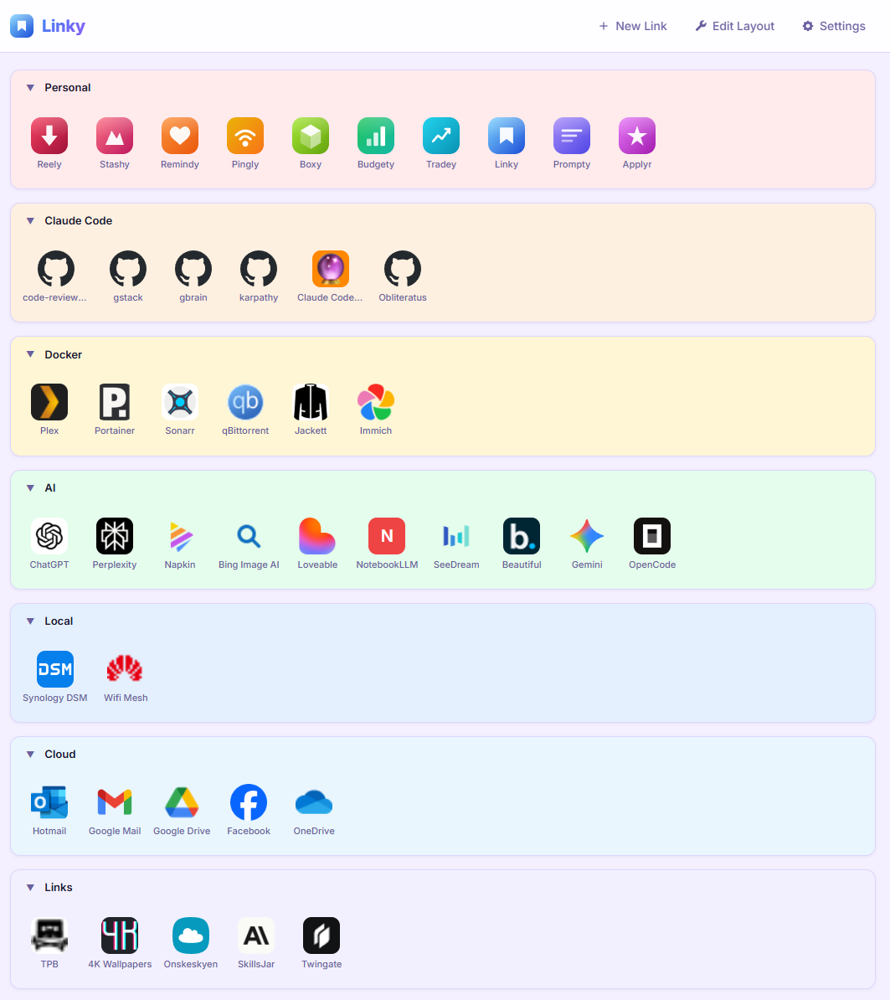

# Linky

A lightweight, self-hosted web launcher. Organize your bookmarks into a drag-and-drop grid with collapsible groups and auto-fetched favicons.

[](LICENSE)
[](https://hub.docker.com/r/larsmikki/linky)
[](https://hub.docker.com/r/larsmikki/linky)
[](https://github.com/larsmikki/linky/commits/main)



---

## Quick Start

### Docker (recommended)

```bash
docker run -d \
  --name linky \
  -p 3020:3020 \
  -v linky-data:/app/data \
  --restart unless-stopped \
  larsmikki/linky:latest
```

Open http://localhost:3020

### Docker Compose

```bash
curl -O https://raw.githubusercontent.com/larsmikki/linky/main/docker-compose.yml
docker compose up -d
```

Open http://localhost:3020

---

## Usage

- **Right-click** the background to add shortcuts or groups
- **Right-click** a shortcut or group to edit, move, or delete
- **Long-press** on touch devices works the same way
- Enable **Arrange Mode** from the context menu to drag items around the grid

---

## Features

- Grid layout with drag-and-drop repositioning
- Auto-fetched favicons with local caching
- Collapsible groups with custom colors
- Manual icon upload with fallback letter tiles
- 10 built-in themes including light and dark modes
- Row and column layout modes
- Import / export for backup and migration
- Responsive — works on mobile and desktop
- Data persisted in SQLite

---

## Configuration

| Environment variable | Default | Description |
|---|---|---|
| `PORT` | `3020` | Port the server listens on |
| `DATA_DIR` | `/app/data` | Directory for database and icon cache |
| `ALLOWED_ORIGINS` | `http://localhost:3020` | Comma-separated allowed CORS origins |

---

## Data Persistence

Data is stored in a Docker volume (`linky-data`) at `/app/data` inside the container. Back up via Settings → Export, or copy the volume contents directly.

---

## Tech Stack

- **Frontend:** React 19, TypeScript, Vite, Tailwind CSS
- **Backend:** Express, TypeScript
- **Database:** SQLite (via sql.js)
- **Icons:** Sharp for image processing

---

## Support

If you find Linky useful, consider [buying me a coffee](https://buymeacoffee.com/larsmikki). Linky is and always will be free, open source, and self-hosted.
